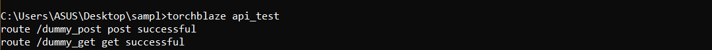

TorchBlaze comes with a inbuilt API testing suite which is required and used extensively when you have created many API Routes for a flask application. This can come handy if you want to save most of your time rather than wasting time in individual Unit Tests for a Flask Restul API.

## Getting Started with APITests
---

Once the Flask Application is created , then you need to run the flask application by running the following command:

```py
python app.py
```

:::caution

If you are running the dockerised container then you need to by default go to http://127.0.0.1:8080/ and check the things. For this reason in the place of host it is written '0.0.0.0' and port number as 8080. If you are not using docker then change host to '127.0.0.1' and port number as you wish.

:::

For now let's consider our application base url is http://127.0.0.1:8080/ 

## Steps for API Testing

### Writing Sample Tests


1. Once you completed the above process then you will find a file tests.json in which you can write the custom tests for your 'POST' Request.  

2. Following is the format in which you need to specify the tests in tests.json.  


```py

{
    <ClassName>:[
        {
            "parameter1":value1,
            "parameter2":value2,
            -
            ---
            -------
            etc
        }
    ]
}

```

3. For Example, lets say you have a POST Request with route "/dummy_post" and class name associated while creating flask-RestFul is "Dummy_Post" then the tests that should be written in tests.json is as follows:-


```py
{
    "Dummy_Post":[
        {
            "p1":v1,
            "p2":v2
        }
    ]
}

```

4. In the above sample p1,p2 are the required parameters and v1, v2 are values associated with it.

### Testing the API's

1. Once you write the sample tests for your 'POST' methods then you need to open the another command prompt or terminal and execute the following command


```py

torchblaze api_test

```

2. Once you execute the above command you will get the output which will look similar to below.



3. In this way this command helps you by automatically extract all the routes and sending requests.


:::note

For now this APITests are available for GET and POST requests.In Future we will update it to the all other request methods.


:::
