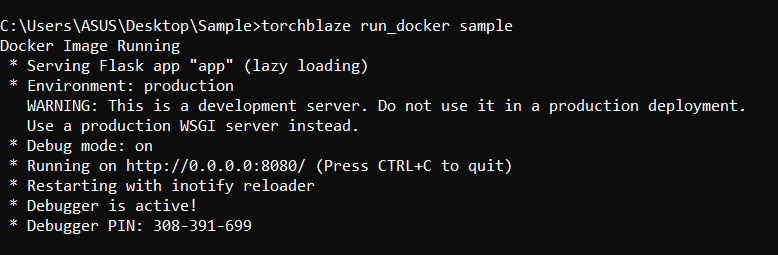

Dockerizing an application is the process of converting an application to run within a Docker container. While dockerizing most applications is straight-forward, there are a few problems that need to be worked around each time.

To overcome all difficulties TorchBlaze comes with an inbuilt module to perform dockerization for ML Models.

Before we proceed you need to install Docker by taking the reference from the setup instructions.

## Steps to Dockerize your Flask ML RESTful API

1. Once you setup the basic file structure and perform all the API checks, then you need to be cautions about the port as 8080 and host address as "0.0.0.0" in app.py.

2. Then go to the main project path in command prompt or terminal .


```py
cd < Project Folder Name >
```

3. For example , if you created a project using template named "Sample" then command would be 

```py
cd Sample
```

4. Now, create a requirements.txt file and add all the required python libraries needed for your project to the requirements.txt file.

5. Once that is done, run the following command to generate the Docker Image for your appliciation.


```py
torchblaze generate_docker IMAGE_NAME
```

:::caution

You can include your own Dockerfile but make sure you need to expose 8080 as the port number which is the default in the template Dockerfile that we provide. 

:::

6. The above command creates the Dockerfile and generates the Docker Image with the following output. But make sure you are in the root location of your project folder.


:::note

Building a Docker Image usually takes some time. This depends on the application size you want to build.

:::

7. Now the Docker image is successfully created. You can view all the docker images using following command in terminal.


```py
docker images
```

8. The output returns you the output similar to the below one where you can find the recently created image.


## Running the Docker Image

1. To run your Docker Image you need to use the following command.


```py
torchblaze run_docker IMAGE_NAME
```

2. The output looks as follows.



3. You can now navigate to http://127.0.0.1:8080/{route} to check your application.

## Stopping the Docker Container.

1. Major Problem people face is once they apply CTRL-C to the process to stop the applciation it is stopped in the CLI but the port is allocated so you can't run it again.

2. So we need to stop the containers which we created. For this open Docker Desktop which is already installed and click on the containers section on the left navbar. Select the running containers and stop them.

3. It looks similar to this below.


In this way TorchBlaze makes your life easier while dealing with the containerization and Docker for your ML Flask API.
